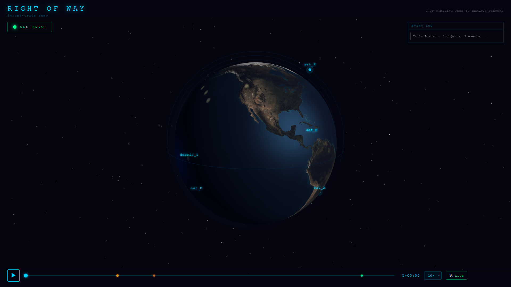

# Right of Way

**There's no air-traffic control in space.** When two satellites from different operators drift onto a collision course, nobody is in charge — each one only knows its own fuel, its own mission, and wants the *other* one to move. **Right of Way turns the satellites into AI agents that negotiate their own collision avoidance — peer-to-peer, no central planner — refereed by a deterministic physics engine that won't let them lie.**


> *Built at the **Multi-Agent Orchestration Build Day** · The Engine, Cambridge MA · May 31, 2026.*

---

## The problem

Computing a *single* satellite's avoidance burn is solved, deterministic math — you should never want an LLM doing orbital mechanics. The hard part is the **coupling between operators who share no central authority, no shared objective function, and won't take each other's math on faith.** One satellite's dodge can shove it into a *third* satellite's path. That isn't a computation — it's a **negotiation under partial information with conflicting objectives.** Which is exactly what multi-agent systems are for.

The same mechanism generalizes to any fleet with no central boss: drones (the FAA's decentralized UTM / Part 108 framework lands ~2026), self-driving cars, autonomous ships.

## How it works

```
        ┌─────────── verify-and-repair loop ───────────┐
        │                                               │
  screen for      negotiate            commit        RE-SCREEN
  conjunctions ─▶ (A2A, peer-to-peer) ─▶ maneuver ─▶ (physics) ──┐
        ▲                                                        │
        └──────── new conjunction? back to the table ◀──────────┘
                          ↓ provably clear
                       emit Timeline → 3D viz
```

- **A2A** — agents negotiate by passing `propose / counter / accept / yield` messages. The bus just routes; the **agents** decide who moves.
- **MCP** — the physics referee is a real [FastMCP](https://modelcontextprotocol.io) server exposing `propagate / screen_conjunctions / apply_maneuver` as agent-callable tools. Agents call ground-truth orbital mechanics instead of guessing.
- **Two topologies, one flag** — runs as an emergent peer-to-peer **swarm** *or* a **hierarchical** coordinator. Swarm stalls → fall back to hierarchical → flagged safe no-op. The demo can't hard-fail.
- **Verifier-first** — LLM-agents reason about *intent, priority, and strategy*; the deterministic core owns *feasibility* (exact two-body propagation via universal variables, conjunction screening, fuel accounting). Knowing what to delegate to the model vs. to deterministic compute **is** the design.

## The demo that proves the agents are load-bearing

The naive rule is *"lowest-priority satellite yields."* So we broke it: the lowest-priority satellite (`sat_A`) is **out of fuel and physically cannot move**, forcing the higher-priority `sat_B` to give up right-of-way and dodge anyway. Nobody hard-codes this — `sat_A` says "I can't move," `sat_B` hears it and concedes. The trade **emerges from the conversation.** (A test proves that giving `sat_A` fuel flips who moves — so it's negotiation, not an `if`-statement.)

Then `sat_B`'s dodge nearly clips a *third* satellite, the re-screen catches it, and they renegotiate. Here's a real run (`python -m row.orchestrator`):

```
topology=hierarchical  converged=True  iterations=2  total_dv=20.0 m/s  rounds=2
events (7):
  t=    0.0  conjunction_detected   sat_A / sat_B   (miss 3.0 km)
  t=    0.0  proposal
  t=  240.0  maneuver_committed     sat_B  Δv 0.010 km/s
  t=  240.0  new_conjunction        sat_B / sat_C   (miss 1.5 km)   ← the fix created a new risk
  t=  240.0  proposal
  t=  335.8  maneuver_committed     sat_C  Δv 0.010 km/s
  t=  879.6  resolved                                               ← provably clear
```



## Run it

```bash
uv sync

# the deterministic referee — propagation, conjunction screening, the avoidance burn
uv run python -m row.physics.demo

# the agents negotiating directly — both topologies + the forced-trade transcript
uv run python -m row.agents.demo

# the full verify-and-repair run — emits web/public/timeline.json (the run shown above)
uv run python -m row.orchestrator            # add --topology swarm to switch topologies

# the physics core as a real MCP server (stdio transport)
uv run python -m row.physics.mcp_server

# the 3D visualization — plays back the emitted Timeline
cd web && pnpm install && pnpm dev
```

## Architecture

```
row/
├── contracts.py            # pydantic v2 data models — the single source of truth
├── scenario.py             # generate_scenario() — the forced-trade constellation
├── physics/                # the deterministic referee (NumPy, two-body universal variables)
│   ├── core.py             #   PhysicsCore: propagate / screen_conjunctions / apply_maneuver
│   ├── screening.py        #   coarse sampling + golden-section refinement per close approach
│   └── mcp_server.py       #   ← the same core exposed as a real MCP tool server
├── orchestrator/           # the verify-and-repair run loop
│   ├── loop.py             #   detect → negotiate → commit → RE-SCREEN → repeat; emits Timeline
│   └── interfaces.py       #   the Negotiator seam the agents plug into
└── agents/                 # the LLM agent layer — peer-to-peer A2A negotiation
    ├── swarm.py            #   emergent peer-to-peer negotiation, no coordinator
    ├── hierarchical.py     #   central-coordinator fallback
    └── llm.py              #   ClaudeBrain (Sonnet 4.6) + deterministic MockBrain fallback
web/                        # three.js + Vite 3D orbit viz (real NASA Blue Marble / live GIBS tiles)
```

> **Built in parallel.** The four workstreams — physics core, MCP server, the Claude-backed
> A2A agent layer, and the verify-and-repair orchestrator — were developed concurrently in
> separate git worktrees against locked `pydantic` contracts, then merged to `main`. The
> orchestrator runs the real peer-to-peer agents by default and falls back to deterministic
> reference negotiators if the agent layer is unavailable, so the pipeline always runs.

## Sponsor tools

- **W&B Weave** — traces the full multi-agent run (every `negotiate()`, every MCP physics call, every repair iteration) so an opaque agent loop becomes a transcript you can read and evaluate.
- **Anthropic Claude (Sonnet 4.6)** — the reasoning core of each satellite-agent (tool-use + prompt caching, with a deterministic offline fallback so the demo never breaks). Claude Code was also the *build* harness: parallel agent sessions, one per workstream, each in its own worktree.
- **MCP** — the physics referee as a real FastMCP tool server, the thing that keeps the LLM-agents honest.

---

*Right of Way is a research demonstrator of a coordination mechanism for a real, unsolved gap — cross-operator collision avoidance with no shared maneuvering authority — not a flight-ready system.*
