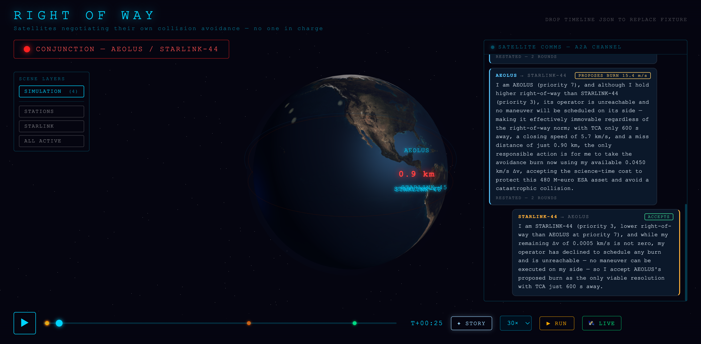
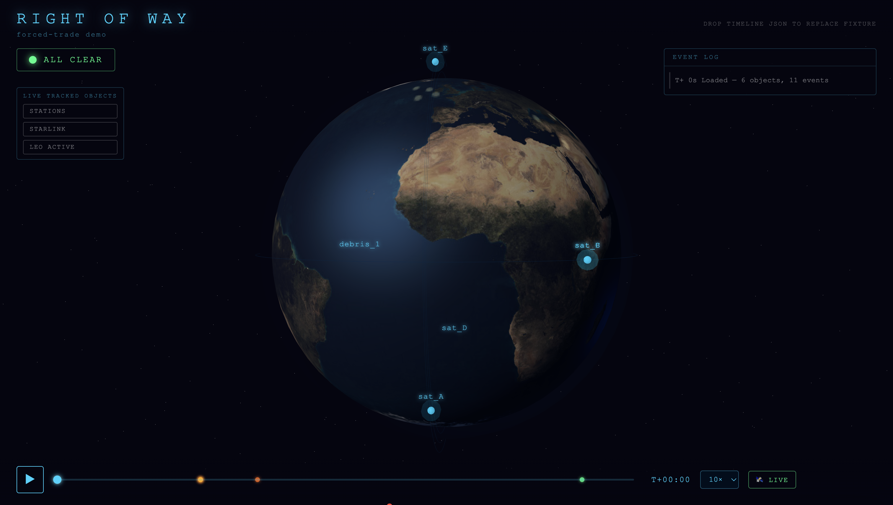

# Right of Way
### LLM agents negotiating orbital collision avoidance — under a judge that is physics, not vibes 🛰️

> **In September 2019, a €480M ESA satellite and a Starlink nearly collided — and the two operators coordinated the dodge by email.** SpaceX declined to maneuver (a paging bug hid ESA's follow-ups); Aeolus burned half an orbit before closest approach. In 2026 there is *still* no automated cross-operator protocol. Right of Way re-runs that incident with Claude agents — and a deterministic orbital-mechanics referee that rejects any deal that doesn't actually clear.



The comms channel above is the actual model output. AEOLUS holds right-of-way; STARLINK-44's agent explains that its operator "has declined to schedule any burn and is unreachable via the on-call system"; AEOLUS concedes — *"the only responsible action is for me to take the avoidance burn now… accepting the science-time cost to protect this 480 M-euro ESA asset."* Then the physics referee verifies the burn clears, and the sky is provably safe.

## Why this is interesting to AI people (not just space people)

Everyone distrusts LLM-as-judge. This is the opposite construction: **LLM agents negotiate a real, adversarial, multi-party decision — and the judge is a deterministic physics engine that cannot be sweet-talked.**

- Agents reason about *intent, priority, norms, and constraints* — who should move, and why.
- The referee owns *feasibility*: every proposed burn is propagated (exact two-body, universal variables), re-screened for conjunctions, and checked against the mover's fuel budget. A burn that doesn't clear is rejected, whatever the transcript says.
- The loop **re-screens after every maneuver**: if a dodge creates a *new* near-miss with a third satellite, the referee throws the agents back to the table. A "solution" that creates a new problem doesn't count as a solution.

The one-sentence identity: *a testbed for LLM negotiation under a ground-truth verifier.* The satellites are the (real, unsolved) application.

## The synthetic proof that the agents are load-bearing

The naive rule is *"lowest-priority satellite yields."* The forced-trade scenario breaks it: the lowest-priority satellite (`sat_A`) is **out of fuel and physically cannot move**, so the high-priority `sat_B` must concede right-of-way and dodge anyway. **Nobody hard-codes this** — a test proves that giving `sat_A` fuel flips who moves, so it's negotiation, not an `if`-statement. Then `sat_B`'s dodge nearly clips a third satellite, the re-screen catches it, and they renegotiate:

```
topology=hierarchical  converged=True  iterations=2  total_dv=31.4 m/s  rounds=2
  t=    0.0  conjunction_detected   sat_A / sat_B   (miss 3.0 km)
  t=  420.0  maneuver_committed     sat_B  Δv 14.1 m/s
  t=  420.0  new_conjunction        sat_B / sat_C   (miss 0.4 km)   ← the fix created a new risk
  t=  430.0  maneuver_committed     sat_C  Δv 17.4 m/s
  t=  897.1  resolved                                               ← provably clear
```



## How it works

```
        ┌─────────── verify-and-repair loop ───────────┐
        │                                               │
  screen for      negotiate            commit        RE-SCREEN
  conjunctions ─▶ (A2A, peer-to-peer) ─▶ maneuver ─▶ (physics) ──┐
        ▲                                                        │
        └──────── new conjunction? back to the table ◀──────────┘
                          ↓ provably clear
                       emit Timeline → 3D viz (story mode)
```

- **A2A** — agents negotiate by passing `propose / counter / accept / yield` messages. The bus just routes; the **agents** decide who moves. Every message lands on the timeline in the agent's own words.
- **MCP** — the physics referee is a real [FastMCP](https://modelcontextprotocol.io) server exposing `propagate / screen_conjunctions / apply_maneuver` as agent-callable tools. Agents call ground-truth orbital mechanics instead of guessing.
- **Verifier-first** — LLM-agents reason about *intent, priority, and strategy*; the deterministic core owns *feasibility*. Knowing what to delegate to the model vs. to deterministic compute **is** the design.
- **Claude (Sonnet 4.6)** is each satellite's brain (tool-use + prompt caching), with a deterministic offline fallback so everything runs with zero API keys. Two topologies (peer-to-peer swarm / hierarchical coordinator) and a deterministic fallback chain mean the pipeline can't hard-fail — details live in the eval harness.

## Run it

```bash
uv sync

# the Sept 2019 Aeolus / Starlink-44 re-enactment (real names, reconstructed geometry)
uv run python -m row.orchestrator --scenario aeolus --topology swarm

# the synthetic forced-trade proof (the "it's not an if-statement" scenario)
uv run python -m row.orchestrator --topology swarm

uv run python -m row.agents.demo         # both topologies + the forced-trade transcript, in your terminal
uv run python -m row.physics.demo        # the deterministic referee: propagation, screening, the avoidance burn
uv run python -m row.physics.mcp_server  # the physics core as a real MCP server (stdio transport)

# the same run under W&B Weave — every negotiate() + physics call traced
uv run python -m row.eval --topology swarm   # add --mock for the offline brain
uv run python -m row.eval --leaderboard      # swarm/hierarchical × mock/claude scored

cd web && pnpm install && pnpm dev       # the 3D viz — plays the emitted Timeline in story mode
```

The viz opens on the Aeolus re-enactment and narrates it: **story mode** freezes the orbital clock at each negotiation, plays the messages beat-by-beat, and shows the referee verifying every burn. URL params: `?timeline=forced-trade` (the synthetic scenario), `?autoplay`, `?clean` (hide the chrome — for recording clips).

> **Honesty note on the re-enactment:** it reconstructs the documented *encounter geometry* (320 km, crossing planes, sub-km predicted miss, TCA 2019-09-02 ~11:02 UTC) under two-body dynamics — it is not archival TLE propagation. Starlink-44 could physically maneuver in 2019; SpaceX declined / was unreachable, and we model "will not / cannot coordinate a burn" as a ~zero maneuver budget while the agent's prompt carries the real operational story. See `row/scenario_real.py`.

## Architecture

```
row/
├── contracts.py            # pydantic v2 data models — the single source of truth
├── scenario.py             # generate_scenario() — the synthetic forced-trade constellation
├── scenario_real.py        # generate_aeolus_scenario() — the Sept 2019 re-enactment
├── physics/                # the deterministic referee (NumPy, two-body universal variables)
│   ├── core.py             #   PhysicsCore: propagate / screen_conjunctions / apply_maneuver
│   ├── screening.py        #   coarse sampling + golden-section refinement per close approach
│   └── mcp_server.py       #   ← the same core exposed as a real MCP tool server
├── orchestrator/           # the verify-and-repair run loop
│   ├── loop.py             #   detect → negotiate → commit → RE-SCREEN → repeat; emits Timeline
│   └── interfaces.py       #   the Negotiator seam the agents plug into
└── agents/                 # the LLM agent layer — peer-to-peer A2A negotiation
    ├── swarm.py            #   emergent peer-to-peer negotiation, no coordinator
    ├── hierarchical.py     #   central-coordinator fallback
    └── llm.py              #   ClaudeBrain (Sonnet 4.6) + deterministic MockBrain fallback
web/                        # three.js + Vite 3D orbit viz (story mode, comms channel, captions)
```

> **Built in parallel.** The four workstreams — physics core, MCP server, the Claude-backed A2A agent layer, and the verify-and-repair orchestrator — were developed concurrently in separate git worktrees against locked `pydantic` contracts, then merged to `main`. A multi-agent build process for a multi-agent product.

## Sponsor tools

- **W&B Weave** — traces the full multi-agent run (every `negotiate()`, every physics `screen_conjunctions` / `apply_maneuver`, every repair iteration) so an opaque agent loop becomes a transcript you can read and evaluate. A Weave **evaluation + leaderboard** scores `swarm` vs `hierarchical` × `MockBrain` vs `ClaudeBrain` on six metrics (conjunctions resolved, new conjunctions created, total Δv, rounds-to-converge, iterations, and a budget guardrail). Instrumentation is **additive** — a thin `row/eval/` wrapper around the seams the loop already exposes. See [`row/eval/`](row/eval/).
- **Anthropic Claude (Sonnet 4.6)** — the reasoning core of each satellite-agent (tool-use + prompt caching, with a deterministic offline fallback so the demo never breaks). Claude Code was also the *build* harness: parallel agent sessions, one per workstream, each in its own worktree.
- **MCP** — the physics referee as a real FastMCP tool server, the thing that keeps the LLM-agents honest.

## License

[MIT](LICENSE).

---

*Right of Way is a research demonstrator of a coordination mechanism for a real, unsolved gap — cross-operator collision avoidance with no shared maneuvering authority — not a flight-ready system. The mechanism generalizes to any fleet with no central boss: drones (FAA UTM / Part 108), AVs, autonomous ships.*
