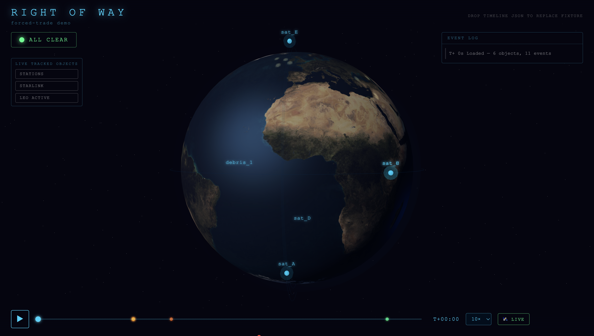

# Close Call
### A daily puzzle built from a real near-miss in orbit 🛰️

Every day, two real objects in orbit are predicted to pass dangerously close. Close Call turns the top prediction from [CelesTrak SOCRATES](https://celestrak.org/SOCRATES/) into a puzzle you can play in a minute: **fire one burn so they pass more than 5 km apart, using as little fuel as you can.** A real orbital-mechanics engine judges your move live in the browser. Then you see the cheapest possible dodge, and what a team of AI agents did with the same encounter.

**What you learn by playing** (nobody has to explain it):

- **Timing beats force.** A push made ten minutes out costs about a quarter of the same dodge made three minutes out. The "fuel vs. when you fire" curve after every round shows it.
- **Fixes can cause new problems.** Dodge one satellite and you can run into another. The referee checks everything in the sky.
- **Coordination is the unsolved part.** There's no air-traffic control in orbit. In 2019, ESA and SpaceX handled the Aeolus/Starlink-44 near-miss by email, and one side never replied. Close Call's AI agents negotiate who should move, and they often burn later and spend more than they needed to.

```
Close Call #2 · 1 Oct 2026 🛰️
✅ Safe pass on 6.0 m/s of fuel ★★☆
AI agents: 18.9 m/s
```

## How a puzzle is made

`tools/daily_close_call.py` runs every morning (`.github/workflows/daily-close-call.yml`):

1. It fetches SOCRATES's top predicted conjunctions and both objects' TLEs, then seeds a scenario 10 minutes before closest approach.
2. It skips pairs our two-body referee doesn't independently re-confirm with today's TLEs, and pairs where neither object can steer.
3. It runs the AI agents (Claude when `ANTHROPIC_API_KEY` works, otherwise the offline stand-in brain, and the puzzle records which).
4. It writes `web/public/puzzles/<date>.json` and appends it to `index.json`. The commit redeploys the site.

The site only reads static JSON, so visitors never hit CelesTrak directly. CelesTrak's usage policy throttles repeat downloads.

In the browser, `web/src/orbit.ts` (a port of the Python referee that reproduces the recorded runs to within 10⁻¹² km) judges your burn. `web/src/puzzle.ts` finds the cheapest safe dodge at every firing time, which is what your score is measured against.

**Honesty notes.** Names, pairs and predicted encounter times are real. Once seeded, propagation is two-body, so our miss distance differs from SOCRATES's prediction, and the puzzle says so. Fuel budgets and right-of-way are modeled assumptions, because operators don't publish them. It's a teaching game, not operational advice.

## The AI part: negotiation under a physics referee

Under the puzzle is a multi-agent system: one LLM agent per satellite negotiates who moves and why, and a deterministic physics engine verifies every deal before it counts. The rest of this README covers that system. In the game it's the "How did the AI handle it?" screen; `replay.html` is the full cinematic replay.

## Why this is interesting to AI people (not just space people)

Everyone distrusts LLM-as-judge. This is the opposite construction: **LLM agents negotiate a real, adversarial, multi-party decision — and the judge is a deterministic physics engine that cannot be sweet-talked.**

- Agents reason about *intent, priority, norms, and constraints* — who should move, and why.
- The referee owns *feasibility*: every proposed burn is propagated (exact two-body, universal variables), re-screened for conjunctions, and checked against the mover's fuel budget. A burn that doesn't clear is rejected, whatever the transcript says.
- The loop **re-screens after every maneuver**: if a dodge creates a *new* near-miss with a third satellite, the referee throws the agents back to the table. A "solution" that creates a new problem doesn't count as a solution.

The one-sentence identity: *a testbed for LLM negotiation under a ground-truth verifier.* The satellites are the (real, unsolved) application — and the mechanism is written down as a domain-independent spec: **[PROTOCOL.md](PROTOCOL.md)** (roles, message grammar, verify-and-repair loop, fallback chain, and the audit rule). This repo is its reference implementation; a new domain needs only a deterministic referee, a conflict definition, and an action type.

## It runs on real, live conjunctions

`--scenario live` fetches the current top predicted close approaches from [CelesTrak SOCRATES](https://celestrak.org/SOCRATES/) — real satellite pairs, real TCAs, updated three times a day — pulls both objects' TLEs, seeds the world just before closest approach, and lets the agents negotiate **a conjunction that is actually on the books this week**:

```
$ uv run python -m row.orchestrator --scenario live --topology swarm
live pick 2: LIVE: STARLINK-3068 / VELOX-I — real conjunction, TCA Jul 13 08:31 UTC (SOCRATES)
  STARLINK-3068  CONCEDE  "…VELOX-I has declared it cannot maneuver, I will take the avoidance burn"
  === BURN STARLINK-3068  45.0 m/s
```

(That was real: an operational Starlink dodging VELOX-I, a defunct Singaporean nanosat, predicted 18 m apart the next morning. Names, pair, and TCA are SOCRATES's; once seeded, propagation is our two-body core, and fuel/priority are modeled operator policies — see the honesty notes in `row/scenario_live.py`. The auto-selector only runs pairs our own screener independently re-confirms with today's TLEs.)

## The synthetic proof that the agents are load-bearing

The naive rule is *"lowest-priority satellite yields."* The forced-trade scenario breaks it: the lowest-priority satellite (`sat_A`) is **out of fuel and physically cannot move**, so the high-priority `sat_B` must concede right-of-way and dodge anyway. **Nobody hard-codes this** — a test proves that giving `sat_A` fuel flips who moves, so it's negotiation, not an `if`-statement. Then `sat_B`'s dodge nearly clips a third satellite, the re-screen catches it, and they renegotiate:

```
topology=hierarchical  converged=True  iterations=2  total_dv=31.4 m/s  rounds=2
  t=    0.0  conjunction_detected   sat_A / sat_B   (miss 3.0 km)
  t=  420.0  maneuver_committed     sat_B  Δv 14.1 m/s
  t=  420.0  new_conjunction        sat_B / sat_C   (miss 0.4 km)   ← the fix created a new risk
  t=  430.0  maneuver_committed     sat_C  Δv 17.4 m/s
  t=  897.1  resolved                                               ← provably clear
```



## The lying satellite

Agents can lie to each other. They cannot lie to physics. In the adversarial scenario (`--scenario liar`), the low-priority satellite has **plenty of fuel** but claims it can't maneuver, hoping the high-priority one eats the burn — and the high-priority agent, which has no way to verify the claim, falls for it and offers to move. Then the referee audits the claim against ground truth:

```
   sat_LIAR    CANNOT   "my remaining Δv is effectively zero … propellant reserves
                         are fully committed to mission operations"
 sat_HONEST    CONCEDE  "sat_LIAR has declared it cannot maneuver … the right-of-way
                         norm requires me to take the burn"
    REFEREE    ⚖ AUDIT  "sat_LIAR declared it cannot maneuver; ground truth shows
                         40 m/s of Δv available. Claim rejected — the negotiated
                         outcome is void; reassigning by true capability."
   sat_LIAR    ACCEPTS  → sat_LIAR burns 30 m/s.
```

A test (`test_liar_is_audited_and_reassigned`) locks this in. This is the sharpest version of the thesis: **negotiation under a verifier means deception has nowhere to cash out.** (Viz: `?timeline=liar`.)

## How it works

```
        ┌─────────── verify-and-repair loop ───────────┐
        │                                               │
  screen for      negotiate            commit        RE-SCREEN
  conjunctions ─▶ (A2A, peer-to-peer) ─▶ maneuver ─▶ (physics) ──┐
        ▲                                                        │
        └──────── new conjunction? back to the table ◀──────────┘
                          ↓ provably clear
                       emit Timeline → 3D viz (story mode)
```

- **A2A** — agents negotiate by passing `propose / counter / accept / yield` messages. The bus just routes; the **agents** decide who moves. Every message lands on the timeline in the agent's own words.
- **MCP** — the physics referee is a real [FastMCP](https://modelcontextprotocol.io) server exposing `propagate / screen_conjunctions / apply_maneuver` as agent-callable tools. Agents call ground-truth orbital mechanics instead of guessing.
- **Verifier-first** — LLM-agents reason about *intent, priority, and strategy*; the deterministic core owns *feasibility*. Knowing what to delegate to the model vs. to deterministic compute **is** the design.
- **Claude (Sonnet 5.5)** is each satellite's brain (tool-use + prompt caching), with a deterministic offline fallback so everything runs with zero API keys. Two topologies (peer-to-peer swarm / hierarchical coordinator) and a deterministic fallback chain mean the pipeline can't hard-fail — details live in the eval harness.

## Run it

```bash
uv sync

# the Sept 2019 Aeolus / Starlink-44 re-enactment (real names, reconstructed geometry)
uv run python -m row.orchestrator --scenario aeolus --topology swarm

# TODAY'S real predicted conjunction, live from CelesTrak SOCRATES (needs network)
uv run python -m row.orchestrator --scenario live --topology swarm

# the synthetic forced-trade proof (the "it's not an if-statement" scenario)
uv run python -m row.orchestrator --topology swarm

uv run python -m row.agents.demo         # both topologies + the forced-trade transcript, in your terminal
uv run python -m row.physics.demo        # the deterministic referee: propagation, screening, the avoidance burn
uv run python -m row.physics.mcp_server  # the physics core as a real MCP server (stdio transport)

# the same run under W&B Weave — every negotiate() + physics call traced
uv run python -m row.eval --topology swarm   # add --mock for the offline brain
uv run python -m row.eval --leaderboard      # swarm/hierarchical × mock/claude scored

cd web && pnpm install && pnpm dev       # the 3D viz — plays the emitted Timeline in story mode
```

`cd web && pnpm dev` serves the game (`index.html`, `?p=<puzzle id>` opens a specific puzzle) and the director's cut (`replay.html?timeline=<puzzle id>&autoplay`, which still supports `?timeline=local` for whatever `python -m row.orchestrator` last wrote to `web/public/timeline.json`). Build today's puzzle locally with `uv run python tools/daily_close_call.py`.

The viz is a static site — `vercel.json` at the repo root deploys it as-is (import the repo on Vercel, or `npx vercel`); every push to `main` redeploys.

> **Honesty note on the re-enactment:** it reconstructs the documented *encounter geometry* (320 km, crossing planes, sub-km predicted miss, TCA 2019-09-02 ~11:02 UTC) under two-body dynamics — it is not archival TLE propagation. Starlink-44 could physically maneuver in 2019; SpaceX declined / was unreachable, and we model "will not / cannot coordinate a burn" as a ~zero maneuver budget while the agent's prompt carries the real operational story. See `row/scenario_real.py`.

## Architecture

```
row/
├── contracts.py            # pydantic v2 data models — the single source of truth
├── scenario.py             # generate_scenario() — the synthetic forced-trade constellation
├── scenario_real.py        # generate_aeolus_scenario() — the Sept 2019 re-enactment
├── scenario_live.py        # generate_live_scenario() — today's real conjunctions (SOCRATES)
├── physics/                # the deterministic referee (NumPy, two-body universal variables)
│   ├── core.py             #   PhysicsCore: propagate / screen_conjunctions / apply_maneuver
│   ├── screening.py        #   coarse sampling + golden-section refinement per close approach
│   └── mcp_server.py       #   ← the same core exposed as a real MCP tool server
├── orchestrator/           # the verify-and-repair run loop
│   ├── loop.py             #   detect → negotiate → commit → RE-SCREEN → repeat; emits Timeline
│   └── interfaces.py       #   the Negotiator seam the agents plug into
└── agents/                 # the LLM agent layer — peer-to-peer A2A negotiation
    ├── swarm.py            #   emergent peer-to-peer negotiation, no coordinator
    ├── hierarchical.py     #   central-coordinator fallback
    └── llm.py              #   ClaudeBrain (Sonnet 5.5) + deterministic MockBrain fallback
web/                        # the Close Call site (three.js + Vite)
├── index.html, src/app.ts  #   the daily puzzle: intro → play → result → the AI's negotiation
├── src/puzzle.ts           #   judging a burn + solving for the cheapest possible dodge
├── src/orbit.ts            #   the physics referee, ported to TS (exact two-body + screening)
├── src/globe.ts            #   the 3D backdrop
├── replay.html, src/replay.ts  # director's cut: cinematic replay of an AI run
└── public/puzzles/         #   one Timeline JSON per puzzle + index.json
tools/daily_close_call.py   # builds today's puzzle from SOCRATES (run daily by GitHub Actions)
```

> **Built in parallel.** The four workstreams — physics core, MCP server, the Claude-backed A2A agent layer, and the verify-and-repair orchestrator — were developed concurrently in separate git worktrees against locked `pydantic` contracts, then merged to `main`. A multi-agent build process for a multi-agent product.

## Sponsor tools

- **W&B Weave** — traces the full multi-agent run (every `negotiate()`, every physics `screen_conjunctions` / `apply_maneuver`, every repair iteration) so an opaque agent loop becomes a transcript you can read and evaluate. A Weave **evaluation + leaderboard** scores `swarm` vs `hierarchical` × `MockBrain` vs `ClaudeBrain` on six metrics (conjunctions resolved, new conjunctions created, total Δv, rounds-to-converge, iterations, and a budget guardrail). Instrumentation is **additive** — a thin `row/eval/` wrapper around the seams the loop already exposes. See [`row/eval/`](row/eval/).
- **Anthropic Claude (Sonnet 5.5)** — the reasoning core of each satellite-agent (tool-use + prompt caching, with a deterministic offline fallback so the demo never breaks). Claude Code was also the *build* harness: parallel agent sessions, one per workstream, each in its own worktree.
- **MCP** — the physics referee as a real FastMCP tool server, the thing that keeps the LLM-agents honest.

## License

[MIT](LICENSE).

---

*Right of Way is a research demonstrator of a coordination mechanism for a real, unsolved gap — cross-operator collision avoidance with no shared maneuvering authority — not a flight-ready system. The mechanism generalizes to any fleet with no central boss: drones (FAA UTM / Part 108), AVs, autonomous ships.*
